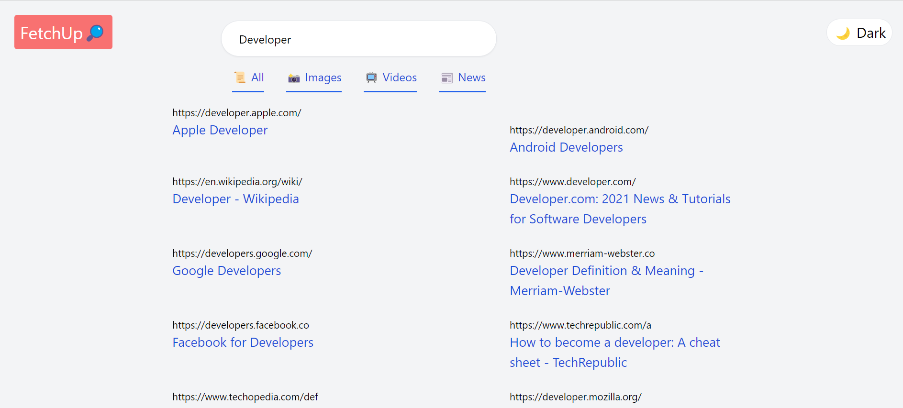
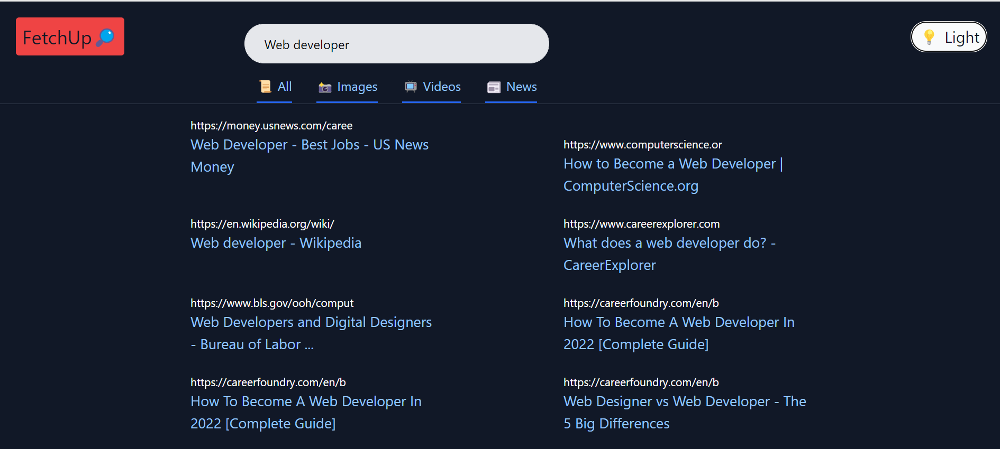
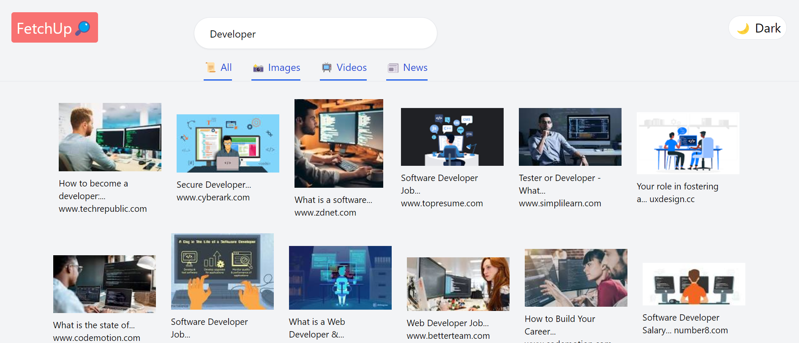

# FetchUp

Hosted Link: https://fetchup.netlify.app

This a Google Search clone which is made by using `ReactJS` and styled by using `TailwindCSS` and the API used for fetching the result is `Google Search API`, which fetched by using `Rapid API`.  

 

## About the project build
This is the landing page which by default show the search results for `Developer`. We can search whatever we want by typing something in place of `Developer`. 
This page also consists of a button to switch the viewing mode between `light mode` and `dark mode`. 
This page also holds the icon `FetchUp` which on click will return the user to the landing page. 
Along wiht the `All` option few other options are given, which on click will route to these pages and provide the user with the desired results.  

 

When we type in the search bar, it routes to the `link` component where the searched data is fetched from the API and it gets through the `reuslts` component and it gets displayed in the homepage.  

  

To get the results instantly to make the search very fast `debounce` was used with a delay of `300 ms`. While our results are loading, a loading animation will be displayed, this was achieved by using `react-loader-spinner`. 
Once the search result appers in the homepage then we can nagivate to different components available in the `Navbar`.
When we click in the `images` portion it will route us to the results which will only display images. 
Then we have the `videos` part which on click will display the vidoes in the results and these vidoes are player using a react dependecy `react-player`. 
And when we click on the `news` it will display all the news realted to our result.  

 

The API results were fetched inside folder `context` which has a file `ResultContextProvider.js` and this page routed the required data to the components when needed. 
The designing was done using `TailwindCSS`. The dark mode was also achieved by this, and it made our deisgn very elegant and the designing was aslo easy and fast.  

